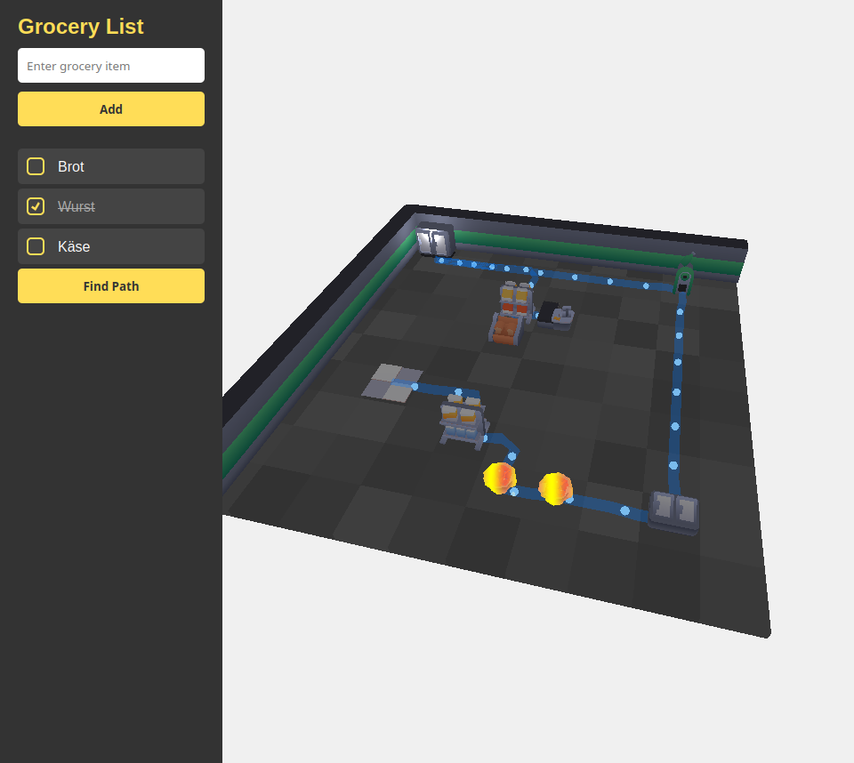

# 🛒 Supermarket Shortest Path Solver

Efficient shopping is no longer a dream! At least I started a project dedicated to this. This project uses **graph algorithms** to solve the **Traveling Salesperson Problem (TSP)** for optimizing grocery shopping in supermarkets. Whether you're in your usual store or navigating unfamiliar aisles, the goal of this project was to start an idea of saving time by using the shortest path for your shopping list.

---

## 📜 Problem Statement

Shopping in a new store can be a hassle. Items are spread out, and it’s hard to find the quickest route to grab everything on your list. This project addresses that by:
1. Modeling the store layout as a graph with nodes (item locations) and weighted edges (distances between locations).
2. Solving the TSP with fixed start and end point to determine the shortest route through the store based on your grocery list.

---

## 🛠️ Technologies Used
- **Python** for the main implementation
- **Flask** for a quick webserver implementation
- **SQLite** as an easy DB solution for a small test project

---

## 📸 Screenshot

Here’s a sneak peek of the beginning of this project in action:

  
*A sample visualization showing the shortest path through a for now random supermarket layout hitting every object once.*
